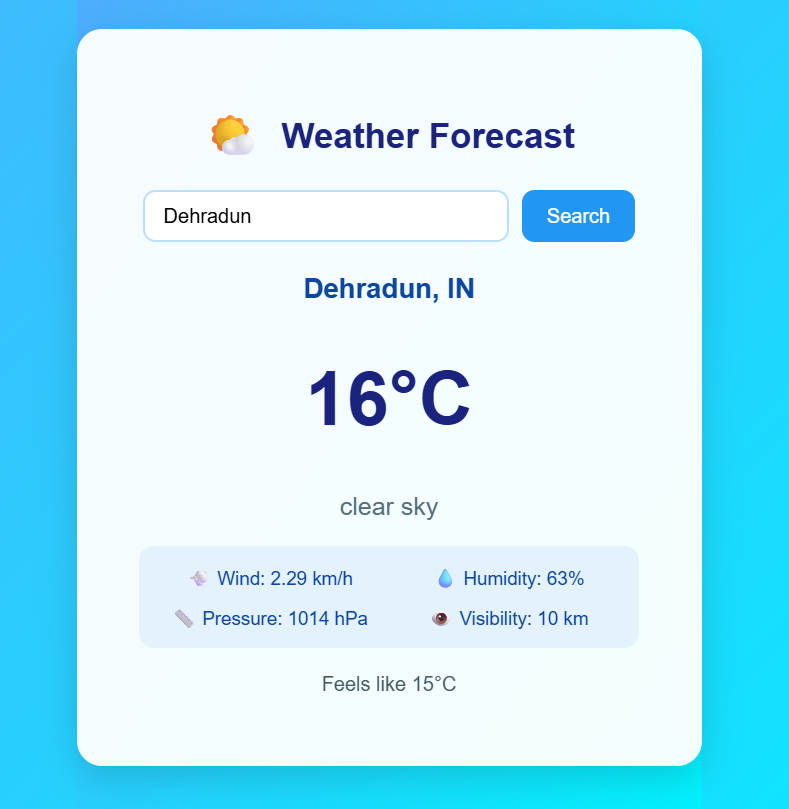

🌦️ Weather Forecast App

A modern full-stack weather forecasting application built using React (frontend) and Spring Boot (backend).
It fetches real-time weather data using the OpenWeatherMap API and displays it with a clean, user-friendly interface.

🚀 Features

✅ Search weather by city name
✅ Displays current temperature, humidity, pressure, wind speed & visibility
✅ “Feels like” temperature display
✅ Beautiful UI with responsive design
✅ Real-time API data fetching
✅ Secure backend with .env key protection
✅ Deployed-ready structure (frontend + backend)

🧱 Tech Stack
🔹 Frontend

React.js

CSS (Custom styling)

Fetch API (for backend communication)

🔹 Backend

Java Spring Boot

REST API using RestTemplate

Jackson JSON Parser

Gradle build system

🔹 API Used

OpenWeatherMap API

⚙️ Project Setup
🖥️ 1. Clone the Repository
git clone https://github.com/<your-username>/weather-app.git
cd weather-app

🧩 2. Backend Setup (Spring Boot)
cd backend

🛠 Add your API key:

In the src/main/resources/application.properties file:

spring.application.name=weather
weather.api.key=YOUR_API_KEY
server.port=8081

⚠️ Don’t commit your API key!
Add .env and application.properties to .gitignore ✅

Run the Spring Boot App:
./gradlew bootRun

💻 3. Frontend Setup (React)
cd frontend
npm install
npm start

The app will run on
👉 Frontend: http://localhost:3000
👉 Backend: http://localhost:8081

🌤️ API Example
Request:
GET http://localhost:8081/api/weather?city=Delhi

Sample Response:
{
  "city": "Delhi",
  "country": "IN",
  "temperature": 26.05,
  "feelsLike": 26.05,
  "condition": "Haze",
  "humidity": 29,
  "pressure": 1011,
  "windSpeed": 3.6,
  "visibility": 3.0
}

🧑‍💻 Folder Structure
weather-app/
│
├── backend/                 # Spring Boot backend
│   ├── src/main/java/...
│   ├── build.gradle
│   └── settings.gradle
│
├── frontend/                # React frontend
│   ├── src/
│   │   ├── components/
│   │   │   ├── WeatherApp.jsx
│   │   │   └── WeatherApp.css
│   │   └── App.js
│   ├── package.json
│   └── public/
│
└── README.md

🛡️ Environment & Security

Create a .env file inside the backend/ folder:

WEATHER_API_KEY=your_openweathermap_api_key

Never commit .env files to GitHub 🚫
Add them to .gitignore

## 🖼️ Screenshot

💬 Full Stack Developer | React & Spring Boot

⭐ Show Support

If you like this project, don’t forget to ⭐ star the reposito
